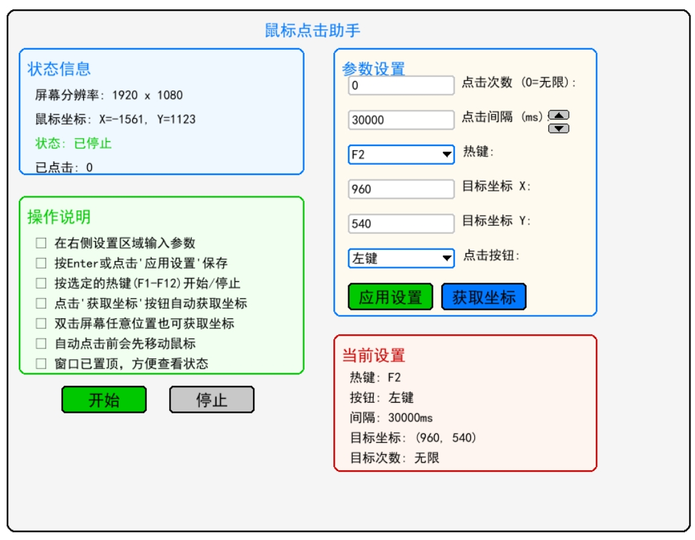
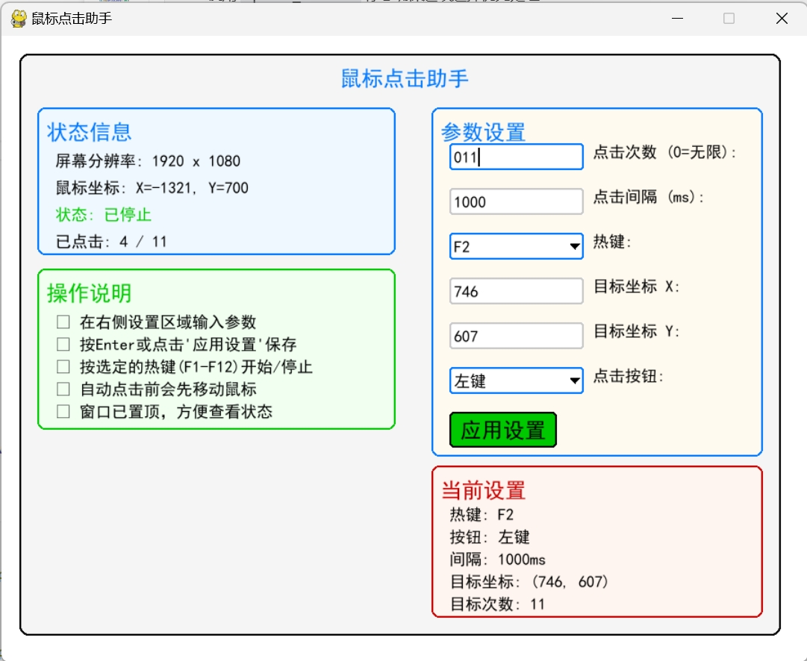

# 鼠标点击助手 v1.1

一个基于Python的鼠标自动点击工具，提供图形化界面和热键控制功能。

## 版本更新

### v1.1 (2025-11-17)
- **解决键盘输入问题**：针对向日葵远程桌面等环境，修复键盘输入失灵问题
- **新增鼠标控制按钮**：添加开始/停止按钮，支持纯鼠标操作
- **优化界面布局**：重新调整UI元素位置和间距，提升视觉效果
- **增强兼容性**：改进键盘事件处理，支持更多输入环境
- **修复已知问题**：解决双击设置坐标功能，优化窗口缩放适配

### v1.0 (初始版本)
- 基础鼠标自动点击功能
- 图形化界面和热键控制
- 实时状态显示和参数设置

## 效果预览







## 功能特性

- ✅ 实时显示屏幕分辨率
- ✅ 实时显示鼠标坐标位置
- ✅ 可设置自动点击次数（0表示无限）
- ✅ 支持左键/右键点击选择
- ✅ 可调节点击间隔时间（毫秒）
- ✅ F1-F12热键控制开始/停止
- ✅ 自定义目标点击坐标
- ✅ 美观简洁的图形界面
- ✅ **新增**：鼠标点击开始/停止按钮
- ✅ **新增**：上下按钮调节间隔时间
- ✅ **优化**：窗口自适应缩放布局
- ✅ **优化**：键盘输入兼容性增强

## 安装依赖

在运行程序前，请先安装所需的Python包：

```bash
pip install -r requirements.txt
```

或者手动安装：

```bash
pip install pygame pyautogui pynput keyboard Pillow
```

## 使用方法

1. 运行程序：
   ```bash
   python main.py
   ```

2. 程序启动后，您将看到主界面显示：
   - 当前屏幕分辨率
   - 实时鼠标坐标
   - 当前运行状态
   - 点击统计信息

3. 在主界面直接设置参数：
   - **点击次数**: 设置自动点击的次数（0表示无限循环）
   - **点击间隔**: 设置每次点击之间的间隔时间（毫秒）
   - **点击按钮**: 选择左键或右键点击
   - **控制热键**: 从下拉框选择F1-F12中的一个作为开始/停止快捷键
   - **目标坐标**: 设置鼠标点击的目标位置坐标

4. 配置完成后，有以下方式开始自动点击：
   - **热键控制**：按您设置的F1-F12热键开始/停止
   - **鼠标控制**：点击界面上的"开始"按钮开始，点击"停止"按钮停止
   - **间隔调节**：使用上下箭头按钮调节点击间隔时间（每次增减1000毫秒）

## 界面说明

### 主界面布局
- **顶部标题栏**：程序名称居中显示
- **左侧顶部**：状态信息区域 - 显示屏幕分辨率、鼠标坐标、运行状态和点击统计
- **右侧顶部**：参数设置区域 - 所有设置输入框和下拉框，标签清晰不重叠
- **左侧底部**：操作说明区域 - 详细的使用指南
- **右侧底部**：当前设置区域 - 实时显示生效的参数配置

### 布局特点
- **分区清晰**：四个功能区域互不重叠，边界分明
- **窗口置顶**：程序启动后自动置顶，始终保持可见
- **标签位置**：所有设置标签位于输入框/下拉框右侧，布局更合理
- **光标显示**：激活的输入框显示闪烁光标，便于输入
- **合理间距**：各区域之间有足够间距，信息层次分明

## 技术说明

- **屏幕坐标获取**: 使用pyautogui获取真实屏幕分辨率
- **鼠标控制**: 使用pyautogui进行精确的鼠标移动和点击
- **热键监听**: 使用pynput库实现全局热键监听
- **图形界面**: 使用pygame创建美观的图形界面
- **多线程**: 使用threading实现后台自动点击，不影响界面响应

## 注意事项

1. 程序需要管理员权限才能正常控制鼠标
2. 点击间隔建议设置在100ms以上，避免系统响应不过来
3. 目标坐标不要超出屏幕范围
4. 使用过程中可以随时修改设置
5. 程序退出时会自动停止所有点击操作

## 文件结构

```
mousehelper/
├── main.py          # 主程序文件
├── requirements.txt # 依赖包列表
└── README.md       # 说明文档
```

## 兼容性

- 支持Windows 7/8/10/11
- Python 3.6+
- 需要图形界面环境

## 许可证

本项目仅供学习和个人使用。